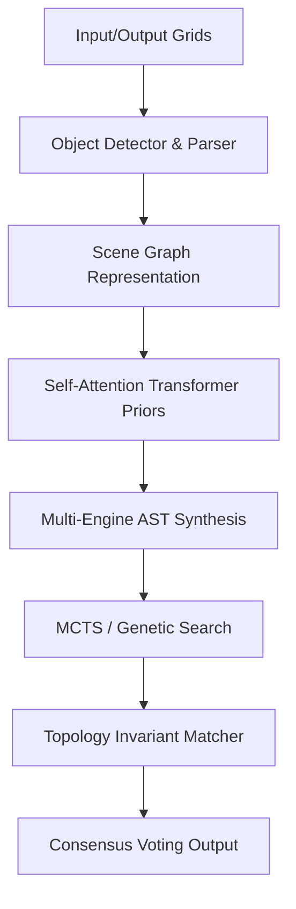

# ARC-AGI-2026 Reasoning Engine

[](https://www.python.org/)
[](#-verification--testing)
[](#-architecture-overview)

An advanced neuro-symbolic reasoning engine designed to solve the Abstraction and Reasoning Corpus (ARC-AGI) visual abstraction tasks. By combining structured search heuristics with multi-engine program synthesis, the solver constructs domain-specific language (DSL) programs matching object transformation laws across demonstrations.

---

## 🚀 Key Features

### 1. Neuro-Symbolic Program Synthesis
- **Multi-Engine Search**: Parallel execution of **Monte Carlo Tree Search (MCTS)**, **Beam Search**, and **Genetic Algorithms** over AST structures.
- **Relational Scene Graphs**: Converts grids into object-oriented graph representations modeling directional, enclosure, and contact interfaces.
- **Continuous Relaxed Optimization**: Relaxes discrete program candidate search spaces into continuous parameters for differentiable search trials.

### 2. Topological & Structural Invariants
- **Homology Loop Verification**: Extracts Betti numbers ($\beta_0$, $\beta_1$) and Euler Characteristic signatures to prune candidate programs violating grid topology.
- **Equivariance-Preserving Spatial Encoder**: Computes shape signatures invariant under Dihedral $D_4$ rotations and reflection symmetries.
- **Multi-Edge Hypergraph Grammar**: Models alignment configurations and color groups across demonstration grid transitions.

### 3. Verification & Search Enhancements
- **Dynamic Task Curriculum**: Sorts training demonstration pairs from easiest to hardest based on Shannon entropy and area metrics to warm-start searches.
- **Topology-Preserving Skeletonization**: Iteratively thins pixel clusters into 1-pixel medial axes for path/maze routing verification.
- **Self-Attention Transformer Priors**: Ranks optimal DSL transformations utilizing scaled dot-product key-query attention maps over grid shape attributes.

---

## 🛠️ Installation & Setup

1. **Clone the Repository**:
   ```bash
   git clone https://github.com/Angrajkarn/ARC-AGI-2026-Paper.git
   cd ARC-AGI-2026-Paper
   ```

2. **Install Dependencies**:
   ```bash
   pip install -r requirements.txt
   ```

---

## 💻 Usage & Commands

### Run Unit Tests
Validate all 174 tests in the test suite:
```powershell
pytest
```

### View Performance Statistics Charts
Render ASCII performance benchmarks comparing search algorithms:
```powershell
python scripts/plot_performance.py
```

### Build & Verify Kaggle Release
Compile the standalone submission notebook and verify execution in an offline sandbox:
```powershell
python scripts/build_kaggle_release.py
python scripts/verify_submission.py
```

### Launch Interactive Web Dashboard
Run the Streamlit visualization inspector:
```powershell
streamlit run src/ui/app.py
```

---

## 📐 Architecture Overview


